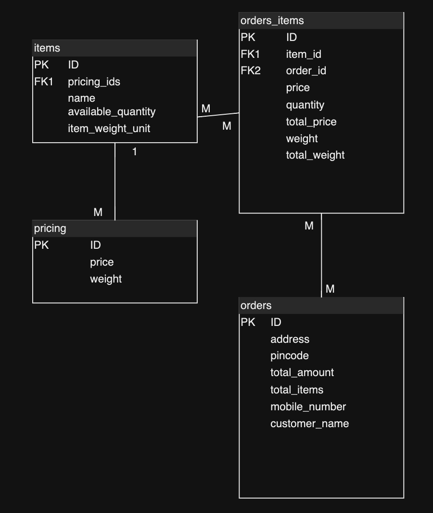

## Module Details
This project contains 3 modules
1. Admin
2. User
3. Item

Item: This module contains all the crud operations that can be done on an item. 

Admin: This module contains admin functionality like adding or updating items in grocery.

User: This module contains user operations like order creation.

## Database Overview

Database contains 3 tables.
1. Item
2. Pricing
3. Orders

Below is the UML diagram of the same

One item can have different price as per their weight. Here mobile number is considered for user auth creating order linking to customer. One order can have one customer but multiple items. Order is linked with order_items table to keep order and booked order_item mapping.

## Api details

API curls are documented in open-api.yaml

